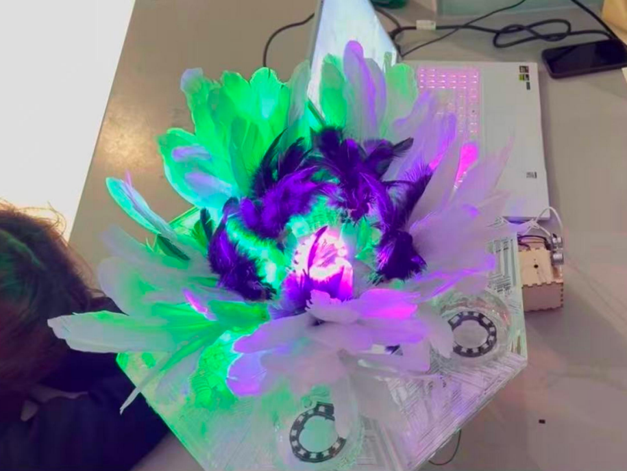
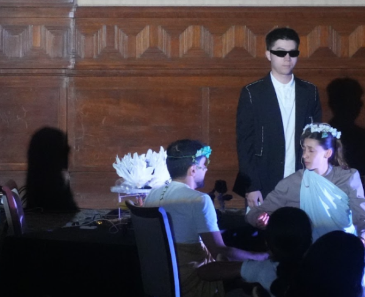
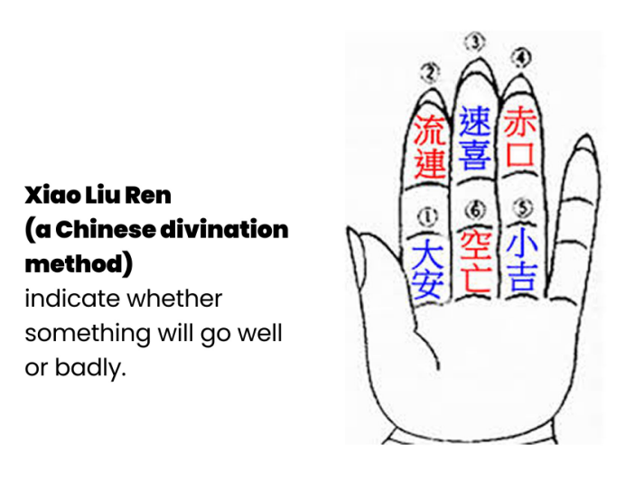
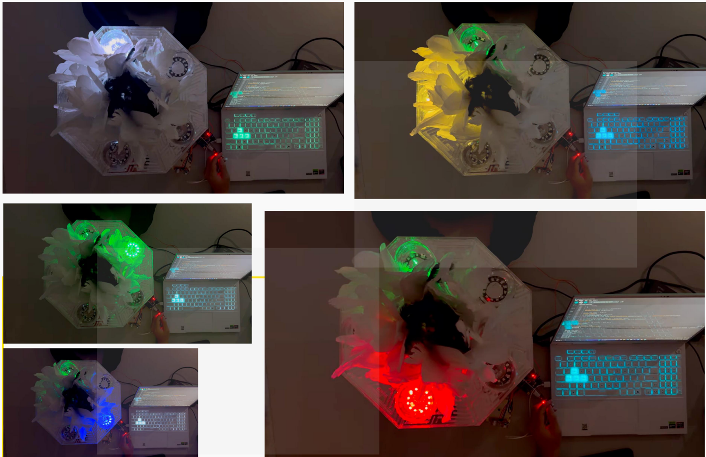
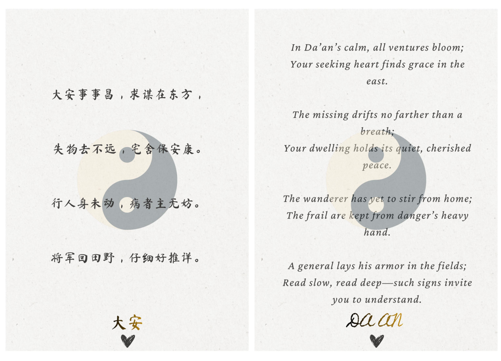
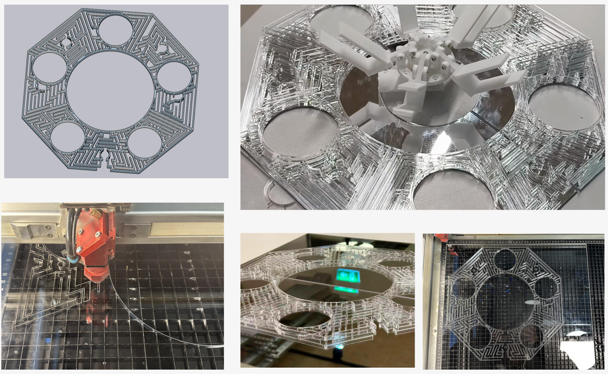
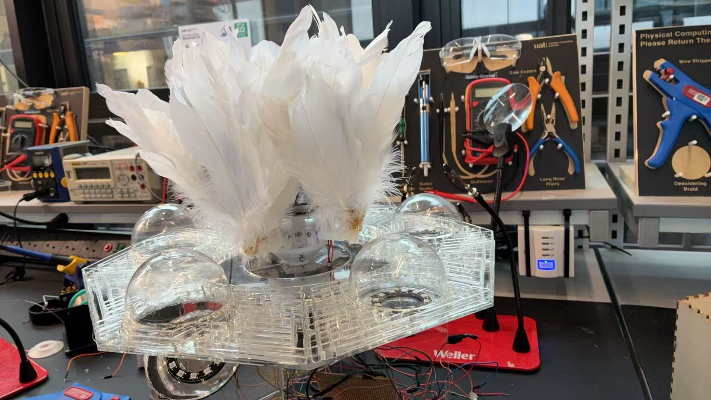
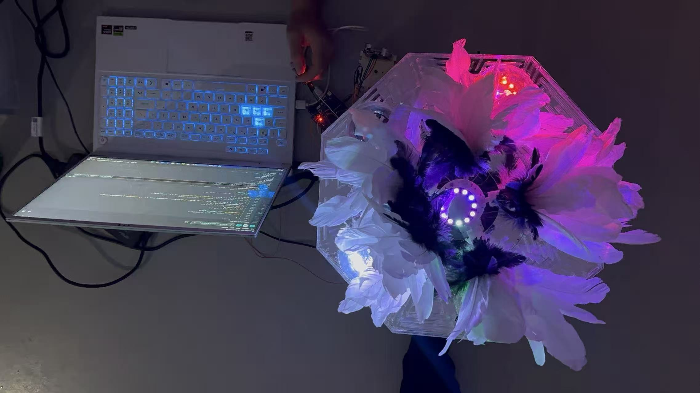

# AURAFLOW
## 基于小六壬传统文化的交互式决策辅助机器人

**项目名称：** AURAFLOW  
**方向：** Physical Computing / Robotics / Human-Robot Interaction / Traditional Culture  
**核心平台：** Arduino UNO R4 WiFi  
**我的主要职责：** Software Development / Arduino Programming / Circuit Planning

项目演示视频：[YouTube Demo](https://youtu.be/r9fNzEMsPME)

AURAFLOW 是一个将中国传统文化“小六壬”的计算逻辑转化为实体机器人交互的团队项目。

项目尝试将传统小六壬中的计算过程转译为传感器输入、程序计算和机械运动，使原本抽象的传统文化规则能够通过一个机械花机器人被感知和体验。

系统通过三个维度获取信息，分别对应 **“天时、地利、人和”**。程序根据输入数据计算小六壬结果，并进一步通过机械花的开合程度、五行灯光、花蕊灯光以及数字界面向用户呈现结果。

这个项目不仅关注最终的机器人形态，也记录了从传感器选择、Arduino 开发、电路规划，到机械结构、材料加工、装配和系统整合的完整原型开发过程。



在第18届社交机器人会议（伦敦）18th International Conference on Social Robotics (ICSR + ART 2026)

闭幕式上，这个机器艺术装置参与了机器人舞台剧的演出




# 1. 项目背景

**什么是小六壬？**

小六壬是一种中国传统推算方法，传统使用方式通常通过手指上的六个位置进行循环计数。

六个位置分别对应六种不同结果，其中包含三个吉向结果和三个凶向结果，并进一步与五行属性产生对应关系。

它具有一个非常适合计算机转译的特点：**整个推算过程具有明确的数字输入、循环计数和结果映射逻辑。**

因此，我们开始思考：

能否将这种传统的手工推算过程转化成一个可以通过传感器获取信息、通过程序进行计算，并最终通过机器人动作表达结果的交互系统？

AURAFLOW 由此产生。




# 2. 项目目标

项目的核心目标并不是简单地制作一个电子版“小六壬计算器”，而是希望把传统文化中的计算逻辑转化成一个具有实体反馈的机器人交互过程。

整个系统需要完成四个基本步骤：

1. 从现实环境和用户行为中获取输入；
2. 将输入映射为“天时、地利、人和”；
3. 使用程序执行小六壬计算；
4. 将抽象的计算结果转化为机械运动、灯光和数字信息。

最终，我们选择 **“花”** 作为机器人的主要表现形式。

不同的小六壬结果不直接以一个数字呈现，而是进一步控制：

- 五行属性灯光；
- 花朵的开合程度；
- 花蕊灯光亮度；
- 对应的小六壬解文。

因此，计算结果从一个抽象数字变成了一个可以被用户直接观察和感知的实体反馈。


# 3. 团队项目与我的职责

AURAFLOW 是一个团队合作项目。

项目成员在早期共同讨论核心概念、视觉方向以及最终方案，并在关键设计节点共同进行方案选择。

### Software / Electronics

**Tanyang Li（我） & Wenzhuo Yan**

主要负责：

- Arduino 程序开发
- 软件逻辑设计
- 输入数据处理
- 小六壬计算逻辑实现
- 传感器测试
- 电路规划
- 输入与输出之间的控制逻辑
- 软件与实体机器人之间的系统整合

### Hardware / Structure

**Zhiqi Yao / Jinge Yang / Guoping Zhi**

主要负责：

- 机械结构设计
- 材料选择
- 花朵结构
- 主盘结构
- 3D 打印
- 激光切割与加工
- 实体结构制作

最终机器人由团队成员共同完成装配和测试。

因此，本项目中我主要关注的是：**如何把传统小六壬的抽象规则转化为可以在 Arduino 上运行，并能够读取现实世界输入、控制实体机器人输出的计算与控制系统。**


# 4. 系统总体设计

AURAFLOW 可以被理解为一个完整的：**Input → Calculation → Output**系统。

```text
现实世界
   ↓
传感器 / 网络数据
   ↓
天时 / 地利 / 人和
   ↓
Arduino UNO R4 WiFi
   ↓
小六壬计算逻辑
   ↓
六种结果之一
   ↓
五行属性
   ↓
机器人状态
   ↓
机械花 + 灯光 + 解文
```

三个输入分别对应：

| 概念 | 数据来源 | 系统中的意义 |
| --- | --- | --- |
| 天时 Tian Shi | 当前时间 | Heaven / Time |
| 地利 Di Li | 经纬度 | Earth / Location |
| 人和 Ren He | 用户手部与超声波传感器之间的距离 | Human / Interaction |

这种映射使“天、地、人”不再只是文化概念，而分别对应机器人能够读取和处理的数据。


# 5. 输入系统设计

项目早期，我们希望通过三个不同的传感器分别获取代表“天时、地利、人和”的数据。

因此，我们测试过多个不同模块和方案。

但实际测试很快暴露出一些问题：

- 光电容积脉搏波（PPG）传感器的数据稳定性不足；
- GPS 在实际测试环境中的信号获取效果较弱；
- 标准 Arduino 无法直接满足我们对实时时间数据的需求；
- Arduino 可用接口数量也成为系统扩展的限制。

由于担心单一微控制器接口不足，以及对供电方案缺乏了解，我们还进行了双微控制器通信测试，希望通过 Master–Slave 的方式让两个控制器协同工作。

但这一方案在测试中没有取得理想效果，同时也进一步增加了整个系统的复杂度。


# 6. 从复杂方案到 Arduino UNO R4 WiFi

经过测试以及与导师讨论后，我们最终决定更换主控制器：

**Arduino UNO R4 WiFi**

这是整个项目中一个重要的技术转折点。

使用 UNO R4 WiFi 后，我们能够通过 WiFi 获取系统需要的时间和位置信息，从而减少额外传感器和双微控制器通信带来的复杂度。

最终系统不再尝试为三个参数分别堆叠独立硬件，而是采用：

```text
Time
    → WiFi / System Data

Location
    → WiFi / Location Data

Human Interaction
    → Ultrasonic Sensor
```

其中“人和”采用超声波传感器。

用户将手放在传感器前方后，系统读取用户手部与传感器之间的距离，并将距离映射到 **0–9** 的数字范围。

这样既能够生成计算所需要的数字，也让用户真正参与到整个计算过程之中。


# 7. 天时、地利、人和的数据映射

当用户第一次按下按钮时，系统开始记录三个数据。

## 天时 Tian

记录当前时间中的秒数。

## 地利 Di

记录当前位置的：

- Latitude
- Longitude

## 人和 Ren

读取超声波传感器距离，并映射到：

```text
0 – 9
```

三个输入随后进入小六壬计算程序。

因此传统概念中的：

```text
天时
地利
人和
```

在系统中被转换成了计算机可以处理的数值数据。


# 8. 小六壬计算逻辑

传统小六壬使用循环计数的方法。

在我们的数字版本中，需要首先处理输入数据中的多个数字。

例如：

```text
Seconds
Latitude
Longitude
Distance
```

时间和经纬度都可能包含多个数字，因此程序会提取其中的数字并进行求和。

在代码实现中，我们首先将数据组合成字符串，然后逐个读取字符。

字符通过减去 ASCII 中 `'0'` 的数值转换为真正的整数：

```cpp
allData.charAt(i) - '0'
```

随后将所有数字累加。

**由于传统手指计数过程中存在起始位置重叠的问题**，程序在计算后进一步进行：

```cpp
(totalSum % 6) - 2
```

小六壬一共有六种可能结果，因此使用：

```text
mod 6
```

将任意大小的输入数字重新映射到六个循环状态。

最终程序得到六种可能的数字状态，对应六种小六壬结果。


# 9. 从计算结果到机器人状态

程序得到小六壬结果之后，并不会只在屏幕上显示一个文字答案。

我们希望让机器人本身成为结果的表达媒介。

因此，最终计算结果会进一步映射到：

```text
Xiao Liu Ren Result
        ↓
Five Elements Attribute
        ↓
Robot State
        ↓
Flower + Light + Digital Information
```

不同结果会改变：

- 对应的五行属性灯；
- 花朵开合状态；
- 花蕊灯光亮度；
- 最终解文。

这使程序计算与机器人实体表现建立了直接联系。


# 10. 两阶段交互设计

项目中一个重要的交互设计是：**用户需要按两次按钮。**

这并不是单纯的程序需求，而是一个有意识设计的交互过程。

## 第一次按下按钮

第一次按下按钮后，系统：

1. 获取当前时间；
2. 获取经纬度；
3. 获取超声波距离；
4. 执行小六壬计算；
5. 保存计算结果。

与此同时，五行灯会依次点亮。

这种灯光动画被设计成机器人的：**“Thinking Process”**

也就是让用户能够感知到系统正在获取信息并进行计算，而不是按下按钮后立即得到答案。


# 11. 为什么需要第二次按下按钮？

第一次计算完成后，机器人不会马上告诉用户最终结果。

用户必须再次按下按钮。

这个交互来自我在项目中的一个思考：

**当一个人决定通过占卜、抽签或者抛硬币寻找答案的时候，他可能已经在内心倾向于某一个答案**

一个典型例子是抛硬币。

真正重要的时刻有时并不是硬币落地之后，而是：

**硬币还在空中的时候，你突然希望它落在哪一面。**

因此，我们故意在：**产生结果和揭示结果之间增加了一次用户操作**

这个短暂的等待过程给用户留下了一点重新思考自己选择的空间。


# 12. 第二次按键：揭示结果

当用户第二次按下按钮后，系统读取之前保存的小六壬结果，并启动对应的控制状态。

机器人随后产生多个同步反馈。

- **五行灯:与结果对应的属性灯被点亮。**
- **机械花:舵机驱动机械花产生不同程度的开合。**
- **花蕊灯：中央花蕊灯根据结果改变亮度。**
- **数字解文：对应的小六壬口诀和解释通过主界面呈现，并以 QR Code 的形式提供给用户。**

因此最终结果并不是一个单一输出，而是由**机械运动 + 灯光 + 数字信息**共同组成。





# 13. 机械花设计

机械花是 AURAFLOW 最主要的实体输出部分。

花朵内部使用 **3D 打印结构**作为骨架，并通过连杆结构与舵机连接。

当舵机旋转时，连杆带动花瓣结构运动，从而实现机械花的打开与关闭。

外部花瓣采用黑白羽毛。

选择羽毛主要有两个原因。

  - 1.光学效果:羽毛能够产生较柔和的透光和散射效果，使内部灯光不会表现为单一的强光点。
  - 2.文化视觉语言:黑白配色同时呼应中国传统文化中的太极视觉意象，使机械结构与整个项目的文化主题保持一致。


# 14. Main Plate 主盘设计

除了机械花之外，机器人还包含一个承载整个交互系统的 Main Plate。

主盘中央为机械花预留开口。

舵机隐藏在主盘下方，使机械结构不会直接暴露在用户视野中。

五行灯围绕中央花朵排列。

底部同时承担隐藏线路和电子元件的功能，使线路从视觉上呈现出类似植物根系的感觉。

这一点同时是因为暴露出电路连接复杂，不简洁，因此通过这种方式进行艺术化处理。

主盘图形采用多层八卦 / 迷宫式视觉结构，使电子系统、机械结构与中国传统文化的视觉语言形成统一。


# 15. 材料与制造过程

项目最初计划使用木材制作主结构。

但实际制作过程中发现，木质方案需要更加复杂的 CNC 加工，同时难以满足我们当时的制造条件，因此团队最终将主要材料调整为：

**Acrylic / 亚克力**

亚克力可以通过激光切割快速制造，但新的问题随之出现。

在实际加工中，我们发现亚克力对激光加工参数和尺寸非常敏感。

如果参数不合适，材料可能：

- 熔化；
- 边缘变黑；
- 出现尺寸误差。

因此制作过程中进行了多次小尺寸测试和尺寸调整。

最终采用多层堆叠结构增加主体的空间层次，并在底部使用镜面亚克力增强视觉效果。




# 16. 系统整合

AURAFLOW 最终需要同时整合：

```text
WiFi Data
Ultrasonic Sensor
Button Input
Arduino Calculation
Servo Control
Five-Element LEDs
Stamen Light
Digital Result
Mechanical Structure
```

因此项目后期的重点不再是单个模块能否工作，而是： **所有模块能否在同一个完整交互流程中稳定工作。**

软件需要负责协调输入、计算和输出之间的状态变化，而硬件结构需要确保舵机、灯光、电路和机械花能够在有限空间内共同工作。

这也是这个项目从一个文化概念转变成实体机器人系统的关键阶段。




# 17. 开发过程中的问题与迭代

## 17.1 输入方案过于复杂

项目早期对硬件能力了解不足，因此尝试了多个传感器以及双微控制器通信。

后来发现 UNO R4 WiFi 已经能够通过 WiFi 解决其中一部分数据需求。

这意味着早期的一部分复杂度其实可以避免。

### Lesson Learned

在设计软件架构之前，应该首先充分理解：

- 主控制器本身具有什么能力；
- 哪些数据必须通过独立传感器获得；
- 哪些数据可以通过网络或者软件直接获得。

否则很容易通过增加硬件来解决原本并不存在的硬件问题。


## 17.2 机械结构寿命问题

最终机械花采用的运动结构

```text
Servo → Linkage → Flower
```

但舵机本身产生的是旋转运动，而花朵连杆需要的运动更加接近线性位移。

这种运动形式之间的不匹配会给 3D 打印底座持续施加额外的机械压力。

因此，虽然最终原型能够完成花朵开合，但这一设计会降低结构长期使用的可靠性。

下一版本可以考虑使用：

**Gear + Rack / 齿轮齿条**

将旋转运动更加合理地转换为线性运动。

这可以减少结构应力，并提高机械花在长期重复运行中的可靠性。


## 17.3 装配流程问题

项目后期另一个明显问题来自装配顺序。

由于早期没有建立完整的 Assembly Plan，一部分线路在结构完全确认之前就已经焊接。

当后续发现：

- 零件无法正确安装；
- 线路长度不合适；
- 接头位置不合理；

时，只能重新剪线和焊接。

部分松动连接也导致额外返工。

下一次制作机器人时，应该在正式焊接固定之前先建立：

```text
Mechanical Assembly
        ↓
Component Placement
        ↓
Wire Routing
        ↓
Cable Length Test
        ↓
Temporary Connection
        ↓
System Test
        ↓
Final Soldering
```

而不是先完成电路，再试图让结构适应已经固定的线路。


# 18. 项目反思

AURAFLOW 对我而言最重要的学习并不只是如何让 Arduino 控制一个机械花。

这个项目让我更加完整地经历了一个机器人装置从：

```text
Concept
   ↓
Interaction Logic
   ↓
Sensor Selection
   ↓
Electronics
   ↓
Programming
   ↓
Mechanical Structure
   ↓
Fabrication
   ↓
Assembly
   ↓
Testing
   ↓
Iteration
```

逐步形成最终原型的过程。

其中很多问题并不是单纯的软件问题或者硬件问题。

例如：

- 一个舵机的运动方式可能影响结构寿命；
- 结构尺寸可能影响线路布局；
- 控制器的选择可能决定整个传感器架构是否有必要；
- 软件状态与实体反馈必须在最终系统中保持同步。

因此，这个项目让我认识到：**机器人开发并不是把软件、电子和机械分别做好以后简单组合起来，而是在整个开发过程中持续处理不同系统之间的约束和关系。**

---

# 19. Future Improvements

如果继续开发 AURAFLOW，下一版本将重点改进以下几个方面。

## 1. 更早进行系统架构验证

在正式开发之前确认：

- Controller Capability
- Sensor Requirements
- Communication Requirements
- I/O Requirements

避免不必要的硬件和通信架构。

## 2. 建立结构化测试流程

对材料、结构和电子系统分别进行：

- Material Test
- Mechanical Test
- Stress Test
- Electronics Test
- Integration Test

再进入最终装配。

## 3. 改进机械花传动结构

将目前的 Servo + Linkage 方案进一步优化，例如采用 Gear-and-Rack 结构，提高重复运动的可靠性。

## 4. 提前规划线路与装配顺序

在最终焊接之前完成 Component Placement 和 Wire Routing，减少返工。


# 20. 项目成果

最终原型成功将：**传统小六壬逻辑 → 现实世界数据 → Arduino 计算 → 机器人实体反馈**

连接成一个完整的交互流程。

用户通过时间、位置以及自己的动作共同生成输入。

机器人随后完成计算，并通过花朵运动、五行灯光、花蕊灯光以及数字解文表达结果。

AURAFLOW 因此不仅是一个机械花，也是一个将传统文化规则转化为 Physical Computing 和机器人交互的实验。




# 21. 代码文件

在code文件夹下包含了部分代码,包括

- 舵机调整
- 灯光测试
- 输入逻辑测试
- 完整代码

等

---
