# Biomimetic Snake Robot

## 基于麦克纳姆轮底盘的仿生蛇形舞台机器人

**Mecanum Base · Robotic Arm Head · Eight-Servo Tail · Xbox Control**

这是一个为 **1001 Nights** 机器人戏剧项目开发的仿生蛇机器人。

链接: **https://hoomansamani.com/creative-robotics/creative-robotic-theatre/1001-nights-with-robots/**

项目最初来自之前的方案,我曾经做过通过四个方向的超声波传感器感知物体靠近进而转动的机械臂底座

<video controls src="assets/可移动平台.mp4" title="Title"></video>

**如果把机械臂安装到一个可以移动（转动）的底盘上，它能不能变成一个具有角色和动作表达能力的机器人？**

在后续的舞台项目中，我们把这个想法发展成了一条机械蛇。

最终机器人由三个主要运动部分组成：

- **麦克纳姆轮底盘**负责机器人在舞台上的移动和转向；
- **简化后的机械臂**作为蛇头，用来表现头部姿态；
- **8 个舵机组成的蛇尾**通过带有相位差的正弦波产生连续的蛇形波浪。

最终版本中，机器人可以通过 **Xbox 手柄实时控制** 

操作者使用左摇杆控制麦克纳姆轮底盘，右摇杆控制蛇头，而蛇尾则由 Arduino 持续生成波浪运动。

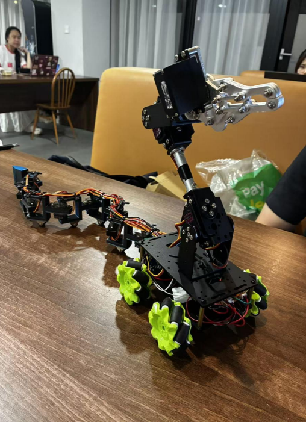

访问链接获取更多项目视频 https://drive.google.com/drive/folders/1l7iNLzpzVcWRPiz366XtCO11-j1wN6Eo?usp=sharing


## 项目信息

**名称:** Biomimetic Snake Robot / 仿生蛇形机器人  
**场景:** 1001 Nights Robot Theatre  
**关键词:** Creative Robotics / Physical Computing / Mechatronics  
**主控制器:** Arduino  
**舵机控制:** PCA9685  
**马达控制:** 2 × SN754410NE  
**输入方式:** Xbox Controller + Python  
**移动:** Four-wheel Mecanum Base （4 × N20 Motors）  
**舵机:** 8 × MF90，2 × MG996R 
**蛇尾关节数量:** 8  

### 个人职责

在这个项目中，我主要负责：

- 蛇尾机械结构的后续迭代
- 舵机、锁孔、连接件和底盘接口的重新测量
- 3D 打印和装配测试
- 舵机回正与校准代码
- 八舵机蛇形波浪运动代码
- 基于相位差正弦波的八舵机蛇尾波浪运动控制
- 早期键盘控制方案
- 电路接线与系统调试
- ESP32 过热和可能的电流回流问题排查
- 麦轮底盘、蛇头和蛇尾的整机集成测试


# 1. Introduction 简介

这个项目的目标并不是制造一条在生物学上完全真实的机器蛇。

真实蛇依靠身体与地面的连续接触、摩擦以及身体形变产生运动。如果直接复制这种运动方式，机械结构和控制系统都会变得非常复杂。

因此，我们采用了一个更适合学生机器人原型和舞台表演的方法：

> **不完整复制真实蛇，而是提取人们最容易识别的蛇形动作。**

我们把蛇的运动拆分成三个相对独立的问题：

```text
Robot Movement
      ↓
Mecanum Base

Head Gesture
      ↓
Robotic Arm Head

Body Wave
      ↓
Eight-Servo Tail
```

麦克纳姆轮负责机器人真正的移动。

机械臂负责表现蛇头的姿态。

蛇尾则不需要推动机器人前进，它的主要任务是产生明显的波浪动作，让整个机器人在移动过程中更像一个有生命的机械动物。

需要指出的是，蛇尾的正弦波同样会实现前进，但是速度较慢且转向不会很灵活

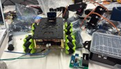

# 2. Design Development 设计发展

项目早期并没有直接确定现在看到的八舵机蛇尾。

最开始，我们考虑过一个更偏舞台道具的方案：

> 使用一个移动小车拖动多个装饰性的“小蛇”，形成蛇群的视觉效果。

第一次讨论之后，我们放弃了单纯拖动装饰物的想法。

之后又尝试设计一个类似车厢的蛇尾结构，通过弹力绳把多个部件连接在一起，希望利用小车摆动和弹力回弹产生蛇尾运动。

这个方案虽然结构简单，但尾巴本身缺少主动控制。

我们还讨论过类似自行车转向结构的机械方案。

经过几轮讨论和测试后，最终决定：

> **使用舵机作为蛇尾的主动关节。**

这样每一个关节都有明确的目标角度，蛇尾的运动也可以直接通过程序进行调整。

最终设计逐渐形成：

```text
Four-wheel Mecanum Base
          +
Reduced Robotic Arm Head
          +
Eight-Servo Articulated Tail
```

# 3. System Architecture 系统结构

最终机器人可以分为四个主要系统：

1. Mecanum Mobile Base
2. Robotic Arm Head
3. Eight-Servo Tail
4. Control / Power / Wiring System

整体控制关系如下：

```text
Xbox Controller
       ↓
     Python
 pygame + pyserial
       ↓
Serial Communication
       ↓
     Arduino
      /    \
     /      \
    ↓        ↓
SN754410    PCA9685
  × 2          │
    │          ├── 2 Head Servos
    │          │
    │          └── 8 Tail Servos
    ↓
4 × N20 Motors
    ↓
Mecanum Base
```

最终机器人包含：

- 4 × Mecanum Wheels
- 4 × N20 DC Motors
- 2 × SN754410NE Motor Drivers
- 1 × Arduino
- 1 × PCA9685 Servo Driver
- 2 × Active Head Servos
- 8 × MF90 Tail Servos

最终共有：

> **10 个 active servos**


# 4. Robotic Arm Head 机械臂蛇头

机械臂结构来自之前的机器人实验。

在早期项目中，机械臂底座周围安装了超声波传感器。当某一个方向有物体接近时，机械臂可以转向对应方向。

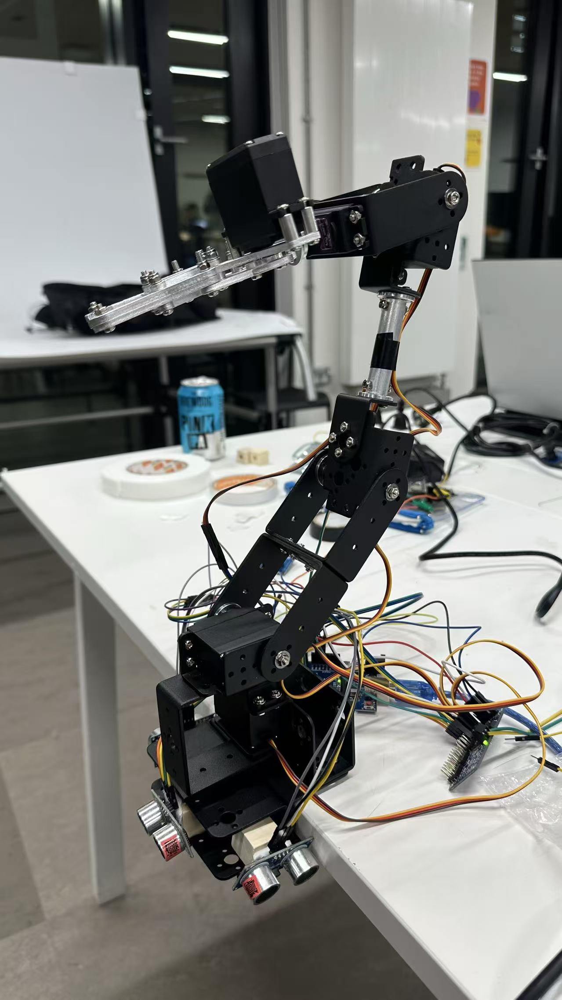

但是这个机械臂也暴露出了一个结构问题：

> 为了支撑上部结构，底部一侧需要加强固定，因此机械臂并不能自由完成 360° 转动。

这也是后来我们开始考虑：

> **让整个机械臂底座本身移动。**

当机械臂被安装到麦克纳姆轮底盘后，它的角色发生了变化。

它不再需要作为一个完整的机械操作臂。

在这个项目中，它主要需要：

> **看起来像蛇头，并完成可见的头部姿态。**

因此最终结构拆除了底部旋转部分，只保留更适合作为蛇头的大臂和小臂部分。

这样可以：

- 减少整体尺寸
- 降低前部重量
- 减少底盘负担
- 保留蛇头需要的动作

最终版本保留两个主动控制的蛇头舵机。


# 5. Mecanum Mobile Base 麦轮移动底座

机器人底盘使用四个麦克纳姆轮。

每个麦克纳姆轮由一个 N20 电机驱动。

```text
Front Left       Front Right

Rear Left        Rear Right
```

麦克纳姆轮底盘可以完成：

- 前进
- 后退
- 横向移动
- 转向

这使机器人可以在舞台上比较灵活地改变位置。

因为最初的底盘只有轮子和电机，并没有完整的电机控制板，所以我们需要自己搭建控制电路。

最终使用：

> **2 × SN754410NE**

作为四个 N20 电机的驱动。

一个 SN754410NE 可以控制两个电机，因此两个芯片可以覆盖四轮底盘。

<video controls src="assets/麦轮演示.mp4" title="Title"></video>

# 6. Motor Driver Development 电机驱动

电机驱动系统经历了多个阶段。

最开始，我们先使用面包板来验证了SN754410NE 是否可以正常驱动两个 N20 电机。

验证成功后，再扩展到四个电机。

之后团队制作了面向 Arduino 的手工焊接控制板，希望减少大量面包板跳线。

由于是手工焊接，出现了多次接触不良的情况，经过多次电路逐步解决了问题，提高了稳定性

在此基础上，我们还尝试制作 ESP32 版本，希望：

- 减少线路
- 获得更多可用接口
- 为后续功能留下更多扩展空间

但是这个尝试后来出现了严重的供电和过热问题。

这也成为整个项目中非常重要的一次系统调试经历。

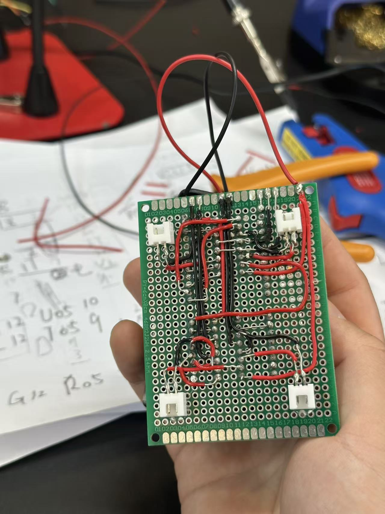


# 7. Eight-Servo Tail 八舵机蛇尾

蛇尾是整个机器人最明显的仿生部分。

最终蛇尾由**8 个 MF90 舵机**组成。

每一个舵机都可以理解为蛇身体上的一个关节。

这些舵机之间通过 3D 打印结构连接。

每一个连接件需要同时解决几个问题：

- 固定舵机本体
- 固定 Servo Horn
- 连接下一节蛇尾
- 留出活动空间
- 支撑蛇尾重量
- 安装辅助小轮

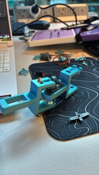


# 8. Tail Mechanical Iteration 蛇尾迭代

蛇尾并不是一次打印成功的。

它经历了多次：

```text
Design
  ↓
3D Printing
  ↓
Assembly
  ↓
Testing
  ↓
Measurement
  ↓
Redesign
```

## 8.1 Version 1

第一版已经包含了几个关键结构：

- Servo Pocket
- Servo Horn Area
- Tail Connection
- Support Wheel Mount

但是实际打印后发现：

> CAD 中的理论尺寸和真实 3D 打印后的尺寸存在差异。

由于没有充分考虑打印机误差和装配公差，部分舵机无法顺利装入。

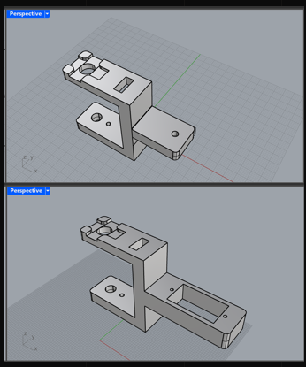

## 8.2 Version 2

第二版根据第一次装配的问题重新调整了一些尺寸。

舵机可以更顺利地安装。

但是运动测试后出现了新的问题：

> 顶部 Servo Horn 的连接并不够稳定。

运行一段时间后，结构可能发生滑动。

这意味着：

```text
Programmed Angle
        ≠
Real Joint Angle
```

## 8.3 Version 3

第三版重新测量了：

- Servo body dimensions
- Locking holes
- Connector geometry
- Tail connection
- Chassis interface

并加入了更完整的固定和连接设计。

这一版本最终成为实际使用的蛇尾结构。

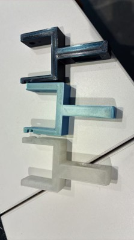


# 9. Servo Centering 舵机校准

在正式安装蛇尾之前，还需要解决一个基础问题：

> 每个舵机的机械零点必须保持一致。

因此我首先编写了舵机回正程序。

在安装 Servo Horn 之前，先让所有蛇尾舵机运动到：

```text
90°
```

之后再将舵机固定在 3D 打印结构中。

这样：

```text
Software Centre
      =
Servo Centre
      =
Mechanical Centre
```

可以尽可能保持一致。

完成回正后，再进行机械装配。

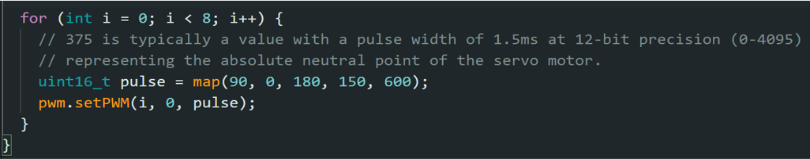


# 10. Serpentine Gait 蛇形步态

如果八个舵机同时进行完全相同的左右摆动：

那么整个蛇尾只会一起摆动。

它不会产生沿着身体传播的波浪。

因此蛇尾控制的关键是：

> **让相邻关节之间存在一定的相位差。**


## 10.1 Core Equation 核心公式

蛇尾使用带有相位差的正弦波：

```text
θᵢ(t) = A · sin(ωt − i · Δφ) + θ_offset
```

其中：

| 参数 | 含义 |
|---|---|
| `θᵢ(t)` | 第 i 个关节当前的目标角度 |
| `A` | 左右摆动幅度 |
| `ω` | 波随时间变化的速度 |
| `i` | 当前关节编号 |
| `Δφ` | 相邻两个关节之间的相位差 |
| `θ_offset` | 舵机中心角度 |

测试过程中使用过的参数包括：

```cpp
const int numServos = 8;

float amplitude = 35.0;
float phaseShift = PI / 4.0;
float offsetAngle = 90.0;
```

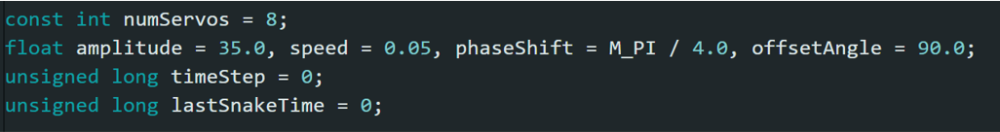

## 10.2 Why Phase Shift Matters 相位差重要性

如果：

```text
Δφ = 0
```

所有舵机基本同步运动。

而当不同关节之间加入相位差之后：

```text
Joint 0    ~~~~~~~

Joint 1      ~~~~~~~

Joint 2        ~~~~~~~

Joint 3          ~~~~~~~

Joint 4            ~~~~~~~
```

波形就会沿着蛇尾传播。

从视觉上看，蛇尾会形成一个连续移动的曲线。

<video controls src="assets/蛇形波.mp4" title="Title"></video>

# *11. Why the Tail Does Not Propel the Robot 为什么尾巴不能推动机器人

从理论上来说，真实蛇可以通过身体波浪与地面摩擦产生推进力。

但是这个项目已经拥有麦克纳姆轮底盘。

因此我们并不需要让蛇尾承担真正的推进任务。

在这个机器人里：

```text
Mecanum Base
     ↓
Real Movement

Servo Tail
     ↓
Visual Snake Motion
```

这种设计减少了蛇尾机械结构需要承担的任务。

它只需要：

> **看起来像正在运动的蛇身体。**

机器人真正的移动则由四个 N20 电机完成。

对于舞台机器人来说，这种方式更加容易控制，也更加稳定，最重要的速度更快，更敏捷。


# 12. PCA9685 Servo Control 电机控制

机器人中存在多个舵机。

为了避免直接占用大量 Arduino PWM 接口，我们使用：

> **PCA9685**

作为统一的舵机 PWM 控制板。

最终版本的通道分配为：

```text
PCA9685

Channel 0
│
├── Tail Servo 1
├── Tail Servo 2
├── Tail Servo 3
├── Tail Servo 4
├── Tail Servo 5
├── Tail Servo 6
├── Tail Servo 7
└── Tail Servo 8
   Channel 0–7

Channel 8
└── Head Servo 1

Channel 9
└── Head Servo 2

Channel 10–15
└── Reserved
```

也就是说，最终机器人实际使用：

> **10 个 active servo channels**

从软件角度看，每个舵机可以被简化为：

```text
Servo Channel
      +
Target Angle
```

这让多舵机控制更加清晰。


# 13. Xbox Controller 手柄控制

项目早期首先使用键盘控制麦克纳姆轮。

我编写了第一版基础方向控制，用键盘按键测试：

- 前进
- 后退
- 左右运动
- 停止

之后我和队友 Haonan Li 在这个基础上进一步开发了 Python 上位机和 Xbox Controller 控制方式。

最终的控制链路为：

```text
Xbox Controller
        ↓
      pygame
        ↓
      Python
        ↓
     pyserial
        ↓
      Arduino
```

最终操作者不需要通过键盘输入，而可以直接使用手柄控制机器人。


# 14. Controller Mapping 手柄控制

Python 会读取 Xbox Controller 的两个摇杆。

数据被转换后通过串口发送给 Arduino。

使用的串口数据格式为：

```text
J,lx,ly,rx,ry
```

其中：

```text
lx + ly
    ↓
Left Stick
    ↓
Mecanum Base
```

负责机器人移动。

而：

```text
rx + ry
    ↓
Right Stick
    ↓
Snake Head
```

负责蛇头两个舵机。

最终操作方式可以简单理解成：

> **左摇杆控制机器人去哪里，右摇杆控制蛇头起伏。**

同时：

> **八舵机蛇尾继续自动执行波浪运动。**


# 15. Parallel Motion 并行运动

最终系统一个比较重要的特点是：

> 手柄控制与蛇尾波浪可以同时运行。

Arduino 主循环大致包含：

```cpp
void loop() {

    updateSnake();

    handleSerialInput();

    updateXboxTimeout();

    updateManualArmFromJoystick();
}
```

其中：

```text
updateSnake()
```

持续更新蛇尾波浪。

与此同时：

```text
handleSerialInput()
```

继续接收新的手柄信息。

因此机器人可以：

```text
Move
+
Move Head
+
Wave Tail
```

同时进行。


# 16. Manual Control + Procedural Motion 最终控制（实际演出）

最终机器人并不是一个完全自主机器人。

考虑到这是一个舞台表演机器人，操作者需要根据演员和场景实时调整动作。

因此，我们保留了：

> **Human Operator in the Loop**

最终控制方式可以理解为：

```text
                Robot
               /     \
              /       \
             ↓         ↓

      Manual Control   Procedural Motion

       Base + Head           Tail
            ↓                 ↓
      Xbox Controller    Sine-wave Gait
```

操作者负责：

- 机器人位置
- 移动方向
- 蛇头动作

程序负责：

- 持续生成蛇尾波浪

这样可以减少操作者需要实时控制的变量。


# 17. Electronics and Wiring 电路信息

整个机器人同时包含：

```text
4 × DC Motors
      +
10 × Active Servos
      +
Arduino
      +
PCA9685
      +
Motor Drivers
```

因此电路和供电逐渐成为整个项目中最复杂的问题之一。

机器人最初进行了：

```text
Breadboard Test
      ↓
Perfboard / Custom Wiring
      ↓
Arduino Version
      ↓
ESP32 Experiment
      ↓
Back to Arduino
```


# 18. Power Problems 供电问题

供电是整个项目中最重要的实际问题之一。

在 Arduino 控制版本工作后，我们曾经尝试改用 ESP32。

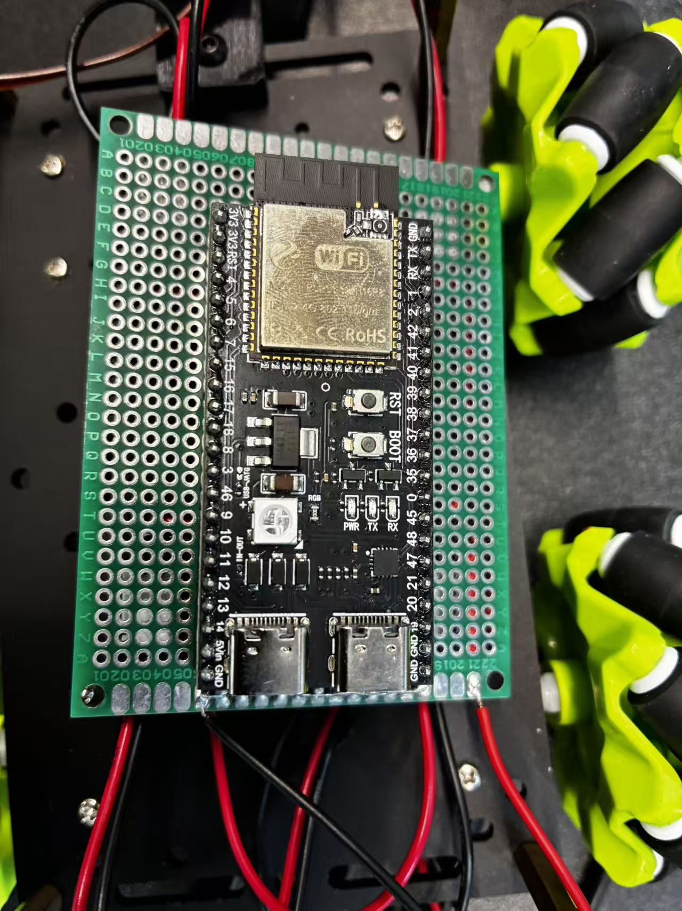

主要原因是希望：

- 减少线路
- 获得更多可用接口
- 为后续功能增加扩展空间

因此团队重新制作了面向 ESP32 的电机控制板。

但是在接线和烧录测试过程中，两块 ESP32 出现了明显过热。

这些问题说明系统中可能存在异常电流路径或供电设计问题。

经过安全排查我们没有发现明显问题，我们又尝试改回Arduino

接下来，我们进一步发现改回Arduino，有的型号也出现了过热问题

这可能是因为机器人需要同时驱动：

```text
4 DC Motors
+
10 Active Servos
+
Main Controller
```

多个舵机同时运动时，会出现较高的瞬时电流需求。

在进一步测试过程中，我们观察到：

- 电机负载时不稳定
- 舵机负载时不稳定
- 控制板发热
- 电池线路过热
- ESP32 异常过热

最严重的就是导致了主板芯片击穿报废，同时还发生了一次电池仓线烧毁

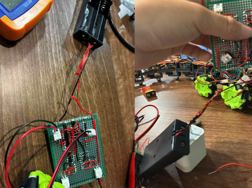

最终我们发现问题是由于，给主板供电的电池，电流反向传给了主板

导致了主板芯片过热击穿，我们调整了供电方案，将电池的电流首先通过主板，解决了这个问题

这确实是整个项目环节中，最关键最严重的问题

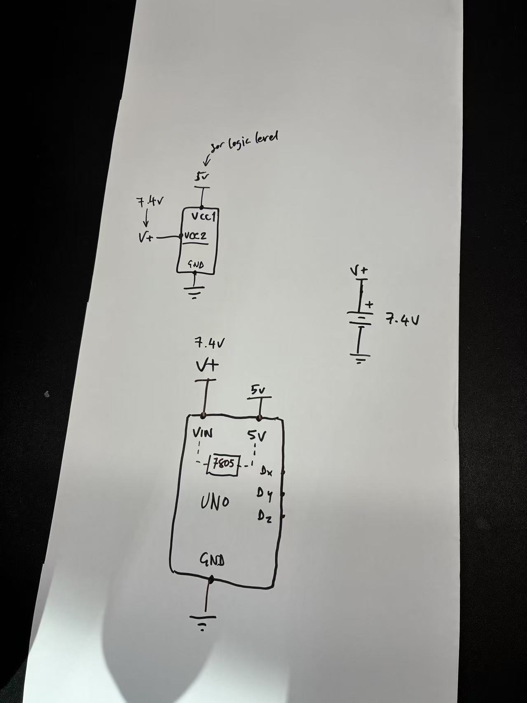

# 19. Final System

最终原型成功整合了：

```text
Four-wheel Mecanum Base
        +
Reduced Robotic Arm Head
        +
Eight-Servo Tail
        +
PCA9685 Servo Control
        +
Arduino
        +
Xbox Controller
```

机器人最终能够：

- 前进和后退
- 横向移动
- 转向
- 调整蛇头姿态
- 持续生成蛇尾波浪
- 使用 Xbox 手柄进行实时控制

<video controls src="assets/final.mp4" title="Title"></video>


# 20. Current Limitations 当前限制

虽然最终机器人已经能够完成基本舞台动作，但它仍然主要是一个：

> **Open-loop Robot**

机器人主要根据：

```text
Human Input
      ↓
Controller
      ↓
Robot Motion
```

运行。

目前它还不能根据舞台环境自动判断：

- 自身姿态
- 周围障碍物
- 演员位置
- 环境变化

因此它目前主要是一个：

> **可控制的表演机器人**

而不是完全自主的机器人。


# 21. Next Iteration 未来方向

如果继续开发这个项目，我认为下面几个方向最值得优先改进。


## 21.1 Closed-Loop Sensing

加入：

- IMU
- Distance Sensor
- Proximity Sensor

让机器人能够感知自己的状态或周围环境。

未来可以让蛇头根据演员或目标的位置自动调整姿态。


## 21.2 Tail and Base Coordination

目前：

```text
Mecanum Movement
```

和：

```text
Tail Wave
```

主要是两个独立系统。

未来可以进一步建立关系：

```text
Robot Speed
     ↓
Tail Wave Speed
```

以及：

```text
Robot Direction
     ↓
Tail Motion
```

这样整个机器人会更像一个统一的身体，而不是“移动小车 + 摆动尾巴”。


## 21.3 Better Power System

当前系统仍然需要分别考虑：

- 电机供电
- 舵机供电
- 控制系统供电

未来可以使用更适合机器人移动平台的电池系统。

但需要同时考虑：

- Discharge Current
- Weight
- Safety
- Runtime


## 21.4 Better Balance

蛇头向前伸出时，会让机器人重心向前移动。

未来可以考虑：

- 后部增加配重
- 限制蛇头最大角度
- 调整底盘内部元件位置

提高整体稳定性。


## 21.5 Better Wiring

机器人最终线路仍然比较密集。

下一版本可以重点改善：

- Cable Routing
- Connectors
- Modular Wiring
- Maintenance Access
- Fault Isolation

目标是：**维修一个模块时，不需要拆开整个机器人。**


# 22. Repository Structure 文件结构

```text
02_Biomimetic_Snake_Robot/
│
├── README.md
├── Report.pdf
├── Project_Slide.pdf
│
├── assets/             //项目图片
│
├── control/
│   ├── dance/          //舞台表演舞蹈部分
│   ├── final1/         //汇报演示代码
│   ├── testservo1/     //舵机测试代码代码
│
└── CAD/
    ├── S1/             //初代模型
    ├── S2/             //迭代模型及打印文件
```

**感谢 UAL-CCI 技术辅助团队对电路排查方面给予的指导和帮助**  
**Special thanks to the UAL-CCI Technical Support Team for their guidance and assistance with circuit troubleshooting.**